<h1 align="center">Brian Thompson</h1>

  Linux-focused engineer building practical tooling for Arch, AUR maintenance, and repeatable developer workflows.

  
  
  
  

  

## About Me

I've built and maintained open source tooling around Linux packaging, release tracking, and automation. Most of my public work is centered on making AUR maintenance and Arch-based development workflows more repeatable, easier to test, and easier to ship.

Based in St. Louis, Missouri, I am especially interested in infrastructure, containers, developer
experience, and the kinds of utility projects that save time every week instead of just looking
clever in a demo.

Most of my work is closed-source.  I'm going to make more of an effort to get back into making
contributions to FOSS projects.

Outside of work, I enjoy spending time with my family, lifting weights, running, hiking, reading,
and writing.

## Current Focus

- Learning how to optimally use AI for coding, planning, and research (not going full-vibe coder)
- Building out websites for local small businesses
- Spending time with family
- Writing about topics that interest me
- Working out, spending time in nature

## Featured Projects

### [`archlinux-aurdev-docker-image`](https://github.com/brianrobt/archlinux-aurdev-docker-image)

Base Docker image for building, testing, and publishing Arch packages to the AUR. This is the clearest example of the kind of practical developer infrastructure work I enjoy: make the environment predictable, then automate the repetitive parts.

### [`aur-pkgbuilds`](https://github.com/brianrobt/aur-pkgbuilds)

Collection of PKGBUILDs for packages I maintain. It serves as the maintenance surface for real AUR work, not just one-off experiments.

### [`aur-pkg-utils`](https://github.com/brianrobt/aur-pkg-utils)

Python utilities for AUR package workflows. This repo reflects my preference for small tools that reduce manual maintenance overhead.

### [`aurvt`](https://github.com/brianrobt/aurvt)

A simple Go tool for detecting upstream releases for AUR packages. It exists to answer a very practical question quickly: what changed upstream, and what needs attention next?

### [`dotfiles`](https://github.com/brianrobt/dotfiles)

My personal Linux configuration, redacted where necessary. It rounds out the profile with the environment and ergonomics side of how I like to work.

## Tools I Reach For Often

  
  
  
  
  
  
  
  
  
  
  

## Contact

- GitHub: [`@brianrobt`](https://github.com/brianrobt)
- Website: [`brianrobt.com`](https://www.brianrobt.com)
- Location: St. Louis, MO, USA
